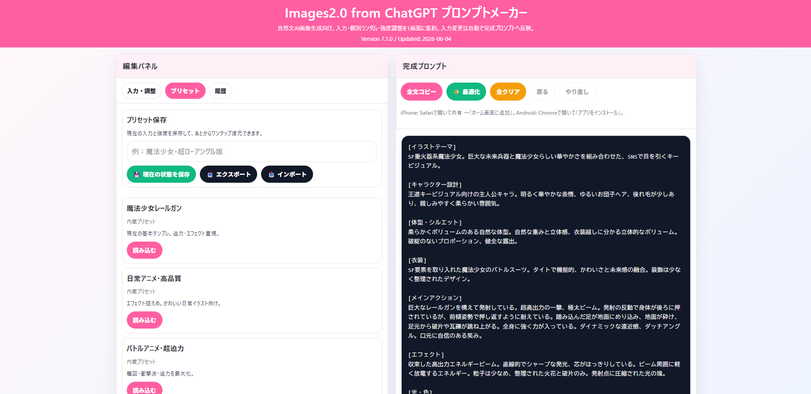

# Images2.0 from ChatGPT プロンプトメーカー

🌸 ChatGPT の画像生成向けに、自然文プロンプトを組み立てるための静的Webアプリです。  
入力欄、ランダム生成、プリセット、履歴保存を使って、イラスト用プロンプトを整理できます。

[日本語](#jp-日本語) | [English](#en-english) | [繁體中文](#tw-繁體中文台灣) | [Español](#es-español)

---

## JP 日本語

### ✨ 主な機能
- 📝 テーマ、キャラクター、衣装、構図、光、ネガティブなどを項目ごとに編集
- 🎲 各項目のランダム生成と、保存したプールからの呼び出し
- 💾 BAT起動時は入力、プリセット、履歴、ユーザー追加プールをローカルJSONへ自動保存
- 📤 JSONでプリセットや履歴をエクスポート・インポート
- 📱 PWA対応。ホーム画面に追加してアプリ風に利用可能

### 🧑‍🏫 かんたんな使い方
1. 🖥️ Windowsでは `start_images2_prompt_manager.bat` を起動します。GitHub Pages版も従来どおり利用できます。
2. 📝 `入力・調整` で、イラストテーマ、キャラクター、衣装、構図などを書きます。
3. 🎲 迷った項目はサイコロボタンを押すと、ランダムで文章が入ります。
4. 📋 保存済みの文章を使いたい時は、メモのようなボタンからプールを開いて選びます。
5. 💾 よく使う文章は、フロッピーディスクのボタンでプールに保存できます。
6. 🎚️ `強度設定` で、アニメ感、迫力、エフェクト、ノイズ抑制などを調整します。
7. 👀 右側の `完成プロンプト` を確認します。入力を変えると自動で更新されます。
8. 📋 `全文コピー` を押して、ChatGPTの画像生成画面に貼り付けます。
9. ⭐ 気に入った状態は `プリセット` に保存すると、あとで同じ設定を呼び出せます。
10. 🕘 当たりプロンプトは `履歴` に保存しておくと、あとで見返せます。

### 💡 ボタンの意味
- 🎲 ランダム：その項目だけ別の文章に変えます。
- 📋 プール：保存済み・内蔵候補から文章を選びます。
- 💾 保存：今の文章を自分用のプールに保存します。
- ✨ 最適化：文章の余分な空白などを整え、安定しやすい設定にします。
- 🧹 全クリア：入力内容をまとめて消します。押す前に確認が出ます。

### 🖥️ Windowsでの推奨起動方法

#### 初回だけ：Node.jsを準備する

1. まず `start_images2_prompt_manager.bat` をダブルクリックします。ブラウザが開けば、Node.jsは導入済みです。
2. 黒い画面に「Node.js is not installed...」と表示された場合は、[Node.js公式ダウンロードページ](https://nodejs.org/en/download)を開きます。
3. **LTS（長期サポート版）**を選び、Windows用インストーラー（`.msi`）をダウンロードします。「Current」ではなく「LTS」を選んでください。
4. `.msi`をダブルクリックし、基本的に `Next` → 利用規約に同意 → `Next` → `Install` → `Finish` と初期設定のまま進めます。
5. Windowsを再起動し、もう一度BATをダブルクリックします。

確認したい場合は、スタートメニューで「コマンドプロンプト」を開き、`node -v`を入力します。`v24...`のように`v`から始まる番号が表示されれば準備完了です。npm操作は不要です。

#### 毎回の起動

1. GitHubからZIPをダウンロードした場合は、右クリックして「すべて展開」します。ZIPの中から直接実行しないでください。
2. 展開したフォルダの `start_images2_prompt_manager.bat` をダブルクリックします。
3. ブラウザで `http://localhost:4175/` が自動で開きます。
4. 使用中は、最小化されている「Images2 Prompt Manager Local Server」の黒い画面を閉じないでください。

> [!IMPORTANT]
> ローカルJSONへ保存したい場合は、毎回BATから起動してください。`index.html`の直接起動やGitHub Pages版は、従来どおりブラウザ保存のみです。

#### 以前のブラウザから移行する

以前から同じ`http://localhost:4175/`を使っていた場合は、ローカルJSONが空のときだけ旧ブラウザデータを自動移行します。BATを起動したまま、以前使っていたブラウザで同じURLを開いてください。

GitHub Pages版や`index.html`直接起動から移す場合は、URLが違うため次の手順を使います。

1. 旧データが見えるブラウザで元のアプリを開きます。
2. `履歴`タブの「全データをバックアップ」を押します。
3. BAT版の `http://localhost:4175/` を開きます。
4. `履歴`タブの「全データを復元」を押し、保存したJSONを選びます。

全データバックアップには、現在の入力、強度、プリセット、履歴、ユーザープール、表示設定が含まれます。
対応ブラウザでは保存先とファイル名を選べます。保存先選択に未対応のブラウザでは、通常のダウンロードフォルダへ保存されます。

### 🔒 データ保存について
- BAT起動時の主データ：`data/images2-prompt-manager.json`
- ひとつ前の状態：`data/images2-prompt-manager.previous.json`
- ブラウザの `localStorage` にも補助キャッシュを残します。
- GitHub Pages版と`index.html`直接起動では、ブラウザの `localStorage`だけを使用します。
- サーバー同期、アカウント同期、クラウド保存はありません。
- アプリのフォルダごと更新・交換する場合は、先に`data`フォルダを安全な場所へコピーしてください。

### 🧭 利用上のメモ
- このツールは画像生成プロンプト作成を補助する個人制作ツールです。
- ChatGPT、OpenAI、niji journey など各サービスの公式ツールではありません。
- 体型やシルエット表現の候補がありますが、全年齢向け・センシティブ回避を意識した表現で使う想定です。

### 🚀 GitHub Pagesで使う
このリポジトリをGitHub Pagesで公開すると、`index.html` をそのままWebアプリとして利用できます。

### 🔄 更新時の注意
公開後に `index.html`、`manifest.webmanifest`、アイコンなどを更新した場合は、`sw.js` の `CACHE_NAME` を変更すると、PWAキャッシュが更新されやすくなります。

## ☕ Support

このプロジェクトが役に立った場合は、Ko-fiで今後の開発を応援していただけると嬉しいです。

☕ https://ko-fi.com/puniq

ご支援ありがとうございます！
---

## EN English

### ✨ Features
- 📝 Edit prompt parts such as theme, character, costume, composition, lighting, and negative prompts
- 🎲 Randomize fields and reuse saved prompt pools
- 💾 Save inputs, presets, history, and custom pools to a local JSON file when launched with the BAT
- 📤 Export and import presets/history as JSON
- 📱 PWA-ready, so it can be added to a home screen

### 🧑‍🏫 Simple How to Use
1. 🖥️ On Windows, run `start_images2_prompt_manager.bat`. The GitHub Pages version remains available.
2. 📝 In `Input & Adjust`, write the theme, character, costume, composition, and other details.
3. 🎲 If you are not sure what to write, press a dice button to fill that field randomly.
4. 📋 To reuse saved text, open the pool button and choose an item.
5. 💾 To save useful text, press the floppy disk button and add it to your pool.
6. 🎚️ Use strength settings to adjust anime style, impact, effects, noise control, and more.
7. 👀 Check the `Final Prompt` area. It updates automatically when you edit the fields.
8. 📋 Press `Copy All` and paste the prompt into ChatGPT image generation.
9. ⭐ Save favorite setups as presets so you can load them again later.
10. 🕘 Save good prompts to history so you can review or reuse them later.

### 💡 Button Guide
- 🎲 Random: replaces only that field with another prompt text.
- 📋 Pool: lets you choose from built-in or saved prompt text.
- 💾 Save: saves the current field text to your personal pool.
- ✨ Optimize: cleans up spacing and adjusts settings for more stable results.
- 🧹 Clear All: clears the current inputs after a confirmation.

### 🖥️ Recommended Windows Setup

1. First, double-click `start_images2_prompt_manager.bat`. If the browser opens, Node.js is already installed.
2. If the black window says “Node.js is not installed...”, open the [official Node.js download page](https://nodejs.org/en/download).
3. Download and run the Windows installer (`.msi`) for the **LTS** release, not “Current.” Keep the default installer options and restart Windows.
4. If you downloaded a ZIP, select “Extract All.” Do not run the app from inside the ZIP.
5. Double-click the BAT. It opens `http://localhost:4175/` automatically.
6. Keep the minimized “Images2 Prompt Manager Local Server” window open while using the app.

No npm command is required. To verify Node.js, open Command Prompt and enter `node -v`.

> [!IMPORTANT]
> Start with the BAT whenever you want local JSON storage. Direct `index.html` and GitHub Pages use browser-only storage.

If the old app already used `http://localhost:4175/`, keep the BAT running and open that URL in the previous browser; the app migrates it when local JSON is empty.

To move from GitHub Pages or direct `index.html`, open the old app where the data is visible, go to `History`, and choose “Back up all data.” Then open the BAT version, choose “Restore all data,” and select the downloaded JSON. The full backup includes inputs, strengths, presets, history, user pools, and display settings.
Supported browsers let you choose the destination and file name. Other browsers use the normal Downloads folder.

### 🔒 Data Storage
- BAT primary data: `data/images2-prompt-manager.json`
- Previous state: `data/images2-prompt-manager.previous.json`
- Browser `localStorage` remains as a secondary cache.
- GitHub Pages and direct `index.html` use browser-only storage.
- There is no server sync, account sync, or cloud storage.
- Copy the `data` folder before replacing the entire app folder with a newer version.

### 🧭 Notes
- This is a personal prompt-helper tool for image generation workflows.
- It is not an official tool from ChatGPT, OpenAI, niji journey, or related services.
- Some prompt pools mention body shape and silhouette, but the intended use is all-ages and avoids sensitive explicit content.

### 🚀 GitHub Pages
When published with GitHub Pages, this repository works as a static web app using `index.html`.

### 🔄 Updating
After publishing, if you update `index.html`, `manifest.webmanifest`, icons, or other cached files, change the `CACHE_NAME` in `sw.js` so PWA caches refresh more reliably.

## ☕ Support

If you find this project useful and would like to support future development, you can support me on Ko-fi.

☕ https://ko-fi.com/puniq

Thank you for your support!
---

## TW 繁體中文（台灣）

### ✨ 主要功能
- 📝 分項編輯主題、角色、服裝、構圖、光線、負面提示詞等內容
- 🎲 可隨機產生各欄位，也可從已儲存的提示詞池呼叫
- 💾 透過BAT啟動時，將輸入、預設、歷史紀錄與自訂提示詞池自動儲存到本機JSON
- 📤 支援以 JSON 匯出、匯入預設與歷史紀錄；支援的瀏覽器可選擇儲存位置
- 📱 支援 PWA，可加入主畫面像 App 一樣使用

### 🧑‍🏫 簡單使用方法
1. 🖥️ Windows請執行 `start_images2_prompt_manager.bat`。仍可繼續使用GitHub Pages版。
2. 📝 在 `輸入・調整` 裡填寫主題、角色、服裝、構圖等內容。
3. 🎲 不知道要寫什麼時，可以按骰子按鈕，讓系統隨機填入文字。
4. 📋 想使用已儲存的文字時，按池子按鈕，從清單中選擇。
5. 💾 常用的文字可以按磁碟按鈕，存到自己的提示詞池。
6. 🎚️ 用強度設定調整動畫感、魄力、特效、降噪等方向。
7. 👀 右側的 `完成提示詞` 會自動更新，可以確認最後結果。
8. 📋 按 `全文複製`，再貼到 ChatGPT 的圖片生成畫面。
9. ⭐ 喜歡的設定可以存成預設，之後一鍵叫回來。
10. 🕘 好用的提示詞可以存到歷史紀錄，之後再看或再用。

### 💡 按鈕說明
- 🎲 隨機：只替換該欄位的文字。
- 📋 池子：從內建或自己儲存的文字中選擇。
- 💾 儲存：把目前欄位的文字存到自己的池子。
- ✨ 最佳化：整理多餘空白，並調整成較穩定的設定。
- 🧹 全部清除：確認後清空目前輸入內容。

### 🖥️ Windows建議啟動方式

1. 先雙擊 `start_images2_prompt_manager.bat`。若瀏覽器正常開啟，表示已安裝Node.js。
2. 若黑色視窗顯示「Node.js is not installed...」，請開啟[Node.js官方下載頁面](https://nodejs.org/en/download)。
3. 下載 **LTS** 的Windows安裝程式（`.msi`），使用預設選項完成安裝並重新啟動Windows。
4. 從GitHub下載ZIP時，請選擇「全部解壓縮」，不要直接從ZIP內執行。
5. 雙擊BAT後，`http://localhost:4175/`會自動開啟。使用期間請勿關閉最小化的伺服器視窗。

不需要執行npm指令。若舊版已使用 `http://localhost:4175/`，請保持BAT執行並用舊瀏覽器開啟該網址，本機JSON為空時會自動移轉。

若要從GitHub Pages或直接開啟的`index.html`移轉，請在看得到舊資料的頁面進入「履歷」，按「備份全部資料」。接著開啟BAT版，在「履歷」按「還原全部資料」，選擇下載的JSON。

### 🔒 資料儲存
- BAT主資料：`data/images2-prompt-manager.json`
- 上一個狀態：`data/images2-prompt-manager.previous.json`
- 瀏覽器 `localStorage`仍作為輔助快取。
- GitHub Pages與直接開啟`index.html`時，只使用瀏覽器儲存。
- 沒有伺服器同步、帳號同步或雲端儲存。
- 更換整個應用程式資料夾前，請先複製`data`資料夾。

### 🧭 使用說明
- 這是個人製作的圖片生成提示詞輔助工具。
- 本工具不是 ChatGPT、OpenAI、niji journey 或相關服務的官方工具。
- 部分提示詞池包含體型與輪廓描述，但預期用途是全年齡並避免敏感露骨內容。

### 🚀 GitHub Pages
透過 GitHub Pages 發佈後，這個 repository 可以直接以 `index.html` 作為靜態 Web App 使用。

### 🔄 更新提醒
公開後若更新 `index.html`、`manifest.webmanifest`、圖示或其他快取檔案，建議修改 `sw.js` 的 `CACHE_NAME`，讓 PWA 快取更容易更新。

## ☕ Support

如果這個專案對您有幫助，歡迎透過 Ko-fi 支持後續開發。

☕ https://ko-fi.com/puniq

感謝您的支持！
---

## ES Español

### ✨ Funciones principales
- 📝 Edita partes del prompt como tema, personaje, vestuario, composición, luz y prompt negativo
- 🎲 Genera campos al azar y reutiliza pools de prompts guardados
- 💾 Al iniciar con el BAT, guarda entradas, presets, historial y pools en un JSON local
- 📤 Exporta e importa presets e historial como JSON; los navegadores compatibles permiten elegir la ubicación
- 📱 Compatible con PWA para añadirlo a la pantalla de inicio

### 🧑‍🏫 Uso fácil
1. 🖥️ En Windows, ejecuta `start_images2_prompt_manager.bat`. La versión de GitHub Pages sigue disponible.
2. 📝 En `Entrada y ajustes`, escribe el tema, personaje, vestuario, composición y otros detalles.
3. 🎲 Si no sabes qué escribir, pulsa el botón de dado para rellenar ese campo al azar.
4. 📋 Para usar texto guardado, abre el botón de pool y elige una opción.
5. 💾 Para guardar texto útil, pulsa el botón de disquete y añádelo a tu pool.
6. 🎚️ Usa los ajustes de fuerza para cambiar estilo anime, impacto, efectos, reducción de ruido y más.
7. 👀 Mira el área de `Prompt final`. Se actualiza automáticamente al editar los campos.
8. 📋 Pulsa `Copiar todo` y pega el prompt en la generación de imágenes de ChatGPT.
9. ⭐ Guarda tus configuraciones favoritas como presets para cargarlas después.
10. 🕘 Guarda buenos prompts en el historial para revisarlos o reutilizarlos.

### 💡 Guía de botones
- 🎲 Aleatorio: cambia solo ese campo por otro texto.
- 📋 Pool: permite elegir texto integrado o guardado.
- 💾 Guardar: guarda el texto actual en tu pool personal.
- ✨ Optimizar: limpia espacios y ajusta opciones para resultados más estables.
- 🧹 Borrar todo: borra las entradas actuales después de confirmar.

### 🖥️ Inicio recomendado en Windows

1. Haz doble clic en `start_images2_prompt_manager.bat`. Si se abre el navegador, Node.js ya está instalado.
2. Si aparece “Node.js is not installed...”, abre la [página oficial de descarga de Node.js](https://nodejs.org/en/download).
3. Descarga el instalador de Windows (`.msi`) de la versión **LTS**, usa las opciones predeterminadas y reinicia Windows.
4. Si descargaste un ZIP, selecciona “Extraer todo”; no ejecutes la aplicación dentro del ZIP.
5. Ejecuta el BAT. Se abrirá `http://localhost:4175/`. Mantén abierta la ventana minimizada del servidor.

No se requiere ningún comando npm. Si la versión anterior ya usaba `http://localhost:4175/`, abre esa URL en el navegador anterior mientras el BAT está activo; se migrará cuando el JSON local esté vacío.

Para migrar desde GitHub Pages o un `index.html` directo, abre la aplicación antigua donde se ven los datos, entra en `Historial` y selecciona la copia de todos los datos. Después abre la versión BAT, elige restaurar todos los datos y selecciona el JSON descargado.

### 🔒 Almacenamiento de datos
- Datos principales del BAT: `data/images2-prompt-manager.json`
- Estado anterior: `data/images2-prompt-manager.previous.json`
- `localStorage` del navegador se conserva como caché secundaria.
- GitHub Pages y `index.html` directo usan solamente el almacenamiento del navegador.
- No hay sincronización con servidor, cuenta ni nube.
- Copia la carpeta `data` antes de sustituir toda la carpeta de la aplicación.

### 🧭 Notas de uso
- Esta es una herramienta personal para ayudar a crear prompts de generación de imágenes.
- No es una herramienta oficial de ChatGPT, OpenAI, niji journey ni servicios relacionados.
- Algunos pools mencionan forma corporal y silueta, pero el uso previsto es para todo público y evita contenido explícito sensible.

### 🚀 GitHub Pages
Al publicarlo con GitHub Pages, este repositorio funciona como una app web estática usando `index.html`.

### 🔄 Actualizaciones
Después de publicar, si actualizas `index.html`, `manifest.webmanifest`, iconos u otros archivos cacheados, cambia el `CACHE_NAME` en `sw.js` para que la caché PWA se actualice con más fiabilidad.

## ☕ Support

Si este proyecto te resulta útil y deseas apoyar su desarrollo futuro, puedes apoyarme en Ko-fi.

☕ https://ko-fi.com/puniq

¡Muchas gracias por tu apoyo!
